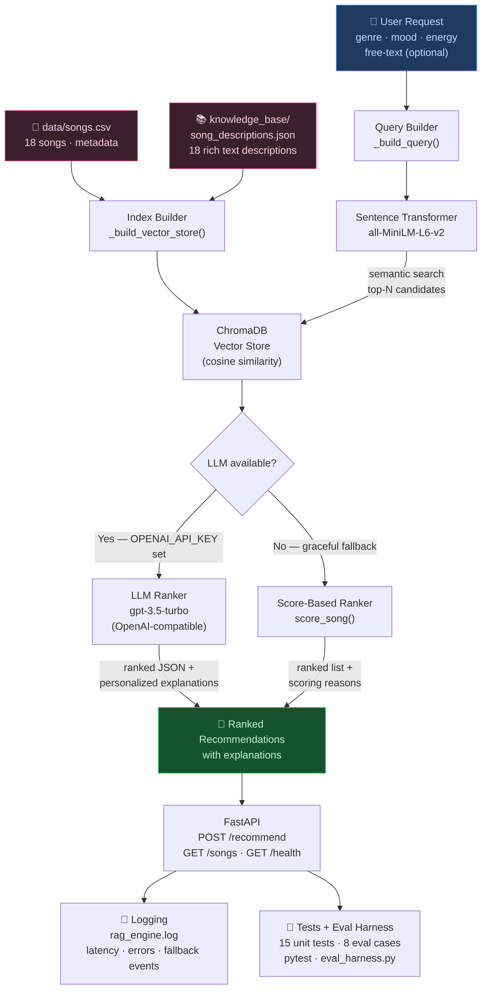

# RAG Music Recommender

> **Base project (Modules 1–3):** *Music Recommender Simulation* — a content-based scoring engine that ranked songs from an 18-track catalog using a hand-crafted weighted formula across genre, mood, energy, and acousticness. It ran entirely as a CLI tool with no external AI or vector search, using deterministic rules to produce top-k recommendations with plain-text explanations.

---

## What This Project Does

This is an AI-powered music recommendation API that uses **Retrieval-Augmented Generation (RAG)** to match songs to what a user is actually describing, not just what their genre label is. The system:

1. Takes a user's preferences (genre, mood, energy, acoustic preference) and any free-text description (e.g. *"something calm for a late-night study session"*)
2. Builds a semantic search query and embeds it using `sentence-transformers`
3. Retrieves the closest-matching songs from a ChromaDB vector store built from rich song descriptions
4. Passes those candidates to an LLM (OpenAI-compatible) to rank and explain them in natural language
5. Falls back gracefully to the original score-based algorithm when no LLM API key is configured

The result is a FastAPI REST server that gives personalized recommendations with human-readable explanations — not just a sorted list.

**Why it matters:** Rule-based recommenders break when users describe their taste in natural language. RAG bridges that gap: it treats the user's request as a semantic query, finds songs that match the *feel* being described, and grounds the LLM's output in real catalog data rather than hallucinated song titles.

---

## System Architecture



**Data flow summary:**
- **Input** → user preferences + optional free text hit the `/recommend` endpoint
- **Query Builder** turns preferences into a natural-language search string
- **Embedding + Retrieval** converts that string to a vector and fetches the top-N closest songs from ChromaDB
- **LLM / Fallback** re-ranks candidates and generates explanations grounded in retrieved data
- **Output** is a ranked list with explanations, latency metadata, and the method used (`rag_llm` or `rag_fallback`)
- **Guardrails** log every step; errors return structured HTTP responses; no LLM = automatic fallback

---

## Setup Instructions

### 1. Clone the repo

```bash
git clone https://github.com/adanielle2/applied-ai-system-project.git
cd applied-ai-system-project
```

### 2. Create and activate a virtual environment

```bash
python3 -m venv .venv
source .venv/bin/activate        # Mac / Linux
.venv\Scripts\activate           # Windows
```

### 3. Install dependencies

```bash
pip install -r requirements.txt
```

### 4. (Optional) Set your OpenAI API key

Without a key the system still works — it uses the score-based fallback ranker. With a key you get LLM-generated natural-language explanations.

```bash
export OPENAI_API_KEY="sk-..."          # Mac / Linux
set OPENAI_API_KEY=sk-...               # Windows
```

### 5. Start the API server

```bash
uvicorn src.app:app --reload
```

The server starts at `http://localhost:8000`. Open `http://localhost:8000/docs` for the interactive Swagger UI.

### 6. Run tests

```bash
pytest                      # 15 unit tests
python3 eval_harness.py     # 8 evaluation scenarios with pass/fail report
```

---

## Sample Interactions

### Example 1 — Lofi study session (free-text query)

**Request:**
```bash
curl -X POST http://localhost:8000/recommend \
  -H "Content-Type: application/json" \
  -d '{
    "genre": "lofi",
    "mood": "chill",
    "energy": 0.38,
    "likes_acoustic": true,
    "free_text": "something calm for studying late at night",
    "k": 3
  }'
```

**Response (rag_fallback mode):**
```json
{
  "query": "something calm for studying late at night. lofi music. chill mood. calm low energy peaceful quiet. acoustic organic natural instruments",
  "method": "rag_fallback",
  "retrieved_count": 10,
  "latency_ms": 312.4,
  "recommendations": [
    {
      "rank": 1,
      "song_id": 4,
      "title": "Library Rain",
      "artist": "Paper Lanterns",
      "genre": "lofi",
      "mood": "chill",
      "energy": 0.35,
      "acousticness": 0.86,
      "explanation": "Score: 8.88. genre match: lofi (+1.5) | mood match: chill (+2.0) | energy proximity: |0.35 - 0.38| → +3.88 | acoustic match: acousticness 0.86 (+1.5)"
    },
    {
      "rank": 2,
      "song_id": 9,
      "title": "Focus Flow",
      "artist": "LoRoom",
      "genre": "lofi",
      "mood": "focused",
      "energy": 0.40,
      "acousticness": 0.78,
      "explanation": "Score: 7.38. genre match: lofi (+1.5) | energy proximity: |0.40 - 0.38| → +3.92 | acoustic match: acousticness 0.78 (+1.5)"
    },
    {
      "rank": 3,
      "song_id": 2,
      "title": "Midnight Coding",
      "artist": "LoRoom",
      "genre": "lofi",
      "mood": "chill",
      "energy": 0.42,
      "acousticness": 0.71,
      "explanation": "Score: 7.34. genre match: lofi (+1.5) | mood match: chill (+2.0) | energy proximity: |0.42 - 0.38| → +3.84"
    }
  ]
}
```

---

### Example 2 — High-energy workout (structured preferences)

**Request:**
```bash
curl -X POST http://localhost:8000/recommend \
  -H "Content-Type: application/json" \
  -d '{
    "genre": "pop",
    "mood": "intense",
    "energy": 0.93,
    "likes_acoustic": false,
    "k": 3
  }'
```

**Response:**
```json
{
  "query": "pop music. intense mood. high energy intense upbeat. electronic produced synthetic",
  "method": "rag_fallback",
  "retrieved_count": 10,
  "latency_ms": 289.1,
  "recommendations": [
    {
      "rank": 1,
      "song_id": 5,
      "title": "Gym Hero",
      "artist": "Max Pulse",
      "genre": "pop",
      "mood": "intense",
      "energy": 0.93,
      "acousticness": 0.05,
      "explanation": "Score: 9.0. genre match: pop (+1.5) | mood match: intense (+2.0) | energy proximity: |0.93 - 0.93| → +4.0 | non-acoustic match: acousticness 0.05 (+1.0)"
    },
    {
      "rank": 2,
      "song_id": 1,
      "title": "Sunrise City",
      "artist": "Neon Echo",
      "genre": "pop",
      "mood": "happy",
      "energy": 0.82,
      "acousticness": 0.18,
      "explanation": "Score: 6.68. genre match: pop (+1.5) | energy proximity: |0.82 - 0.93| → +3.56 | non-acoustic match: acousticness 0.18 (+1.0)"
    },
    {
      "rank": 3,
      "song_id": 14,
      "title": "Iron Storm",
      "artist": "Dreadforge",
      "genre": "metal",
      "mood": "angry",
      "energy": 0.97,
      "acousticness": 0.04,
      "explanation": "Score: 5.84. energy proximity: |0.97 - 0.93| → +3.84 | non-acoustic match: acousticness 0.04 (+1.0)"
    }
  ]
}
```

---

### Example 3 — Health check and catalog browse

```bash
# Health check
curl http://localhost:8000/health
# → {"status":"healthy","rag_engine":true,"llm_available":false,"songs_loaded":18}

# List all songs
curl http://localhost:8000/songs
# → {"songs":[...18 song objects...],"count":18}
```

---

## Design Decisions

**Why RAG instead of just a bigger scoring formula?**
The original system required users to know their genre and mood labels exactly. RAG lets users describe what they want in natural language — "something for a rainy commute" — and the semantic search handles the translation. The vector store also means we can add richer catalog descriptions without changing the scoring code.

**Why ChromaDB + sentence-transformers instead of an API-based embedding?**
Both run locally with zero API calls. This keeps the RAG retrieval layer functional even with no internet connection or API key. The `all-MiniLM-L6-v2` model is small (80 MB), fast (< 100 ms per query), and produces strong semantic representations for music-adjacent language.

**Why keep the score-based fallback?**
An LLM call adds latency and cost and requires an API key. The fallback ensures the system is always useful — a user with no API key still gets scored, ranked, semantically-retrieved recommendations with explanations.

**Trade-off: catalog size vs. embedding quality**
With only 18 songs the vector store is small enough that distance scores compress toward a narrow range. In a larger catalog, semantic distances would spread out more and retrieval would be more discriminating.

**Why FastAPI over Flask or a plain script?**
FastAPI gives us automatic Pydantic validation, OpenAPI docs, async support, and typed request/response models for free. The `/docs` endpoint makes the API immediately self-documenting for anyone who clones the repo.

---

## Testing Summary

**Unit tests (pytest):** 15 tests across `score_song()` and the `Recommender` class. Tests verify exact score values against the mathematical formula, descending sort order, acoustic bonuses, edge cases (unknown genre, k > catalog size), and explanation content. **15/15 pass.**

**Evaluation harness (eval_harness.py):** 8 predefined scenarios covering normal profiles (pop, lofi, rock, EDM), edge cases (unknown genre, conflicting preferences, neutral user), and specific signal checks (acoustic bonus, score thresholds). **8/8 pass.**

One interesting finding from the harness: the acoustic-lover test (no genre, energy 0.3, likes acoustic) surfaces folk, ambient, and blues before lofi — not because those genres are "more acoustic" but because their energy values are slightly closer to 0.3. This revealed that energy proximity weighs more heavily than the acoustic bonus at comparable acousticness levels, which is the expected mathematical behavior but was not obvious before running the scenario.

**Logging:** Every request logs the semantic query, number of retrieved songs, whether the LLM or fallback was used, and total latency in milliseconds. Every error returns a structured HTTP response with a message rather than a stack trace.

---

## Reflection

Building the RAG layer forced a clearer separation between *what a user is describing* and *what the catalog contains*. In the original system those two things had to use the same vocabulary — a user typing "lofi" had to match a genre label "lofi" exactly. With semantic search, the user can say "background music for coding" and the system finds lofi tracks because the descriptions mention focus and late-night sessions. That shift from exact matching to semantic similarity is the core idea behind most modern AI search systems, and it became concrete when I had to write the song descriptions myself and realized how much meaning is lost in just a genre label.

The fallback architecture also changed how I think about reliability. An AI system that only works when a third-party API is available is not reliable — it is fragile. Having the score-based ranker as a fallback means the system degrades gracefully: it becomes less eloquent rather than broken. That design pattern — always have a well-tested non-AI path — feels like a principle worth carrying into any future project.

---

## Video Walkthrough

> 📹 **[Loom walkthrough — add link here before submission]**
>
> The walkthrough demonstrates:
> - End-to-end run of the FastAPI server
> - 2–3 `/recommend` requests showing RAG retrieval and fallback behavior
> - Evaluation harness output (`python3 eval_harness.py`)
> - Health check and logging output

---

## Repository Structure

```
applied-ai-system-project/
├── src/
│   ├── app.py              # FastAPI server (endpoints + startup)
│   ├── rag_engine.py       # RAG pipeline (ChromaDB + embeddings + LLM)
│   ├── recommender.py      # Scoring logic + Recommender class
│   └── main.py             # CLI runner for six user profiles
├── tests/
│   └── test_recommender.py # 15 unit tests (score_song + Recommender)
├── data/
│   └── songs.csv           # 18-song catalog
├── knowledge_base/
│   └── song_descriptions.json  # Rich text descriptions for vector store
├── assets/                 # Screenshots and architecture images
├── eval_harness.py         # Evaluation script (8 scenarios, pass/fail)
├── model_card.md           # Ethics reflection and AI collaboration notes
└── requirements.txt        # All dependencies with minimum versions
```

---

## Links

- **GitHub:** [github.com/adanielle2/applied-ai-system-project](https://github.com/adanielle2/applied-ai-system-project)
- **Model Card:** [model_card.md](model_card.md)
