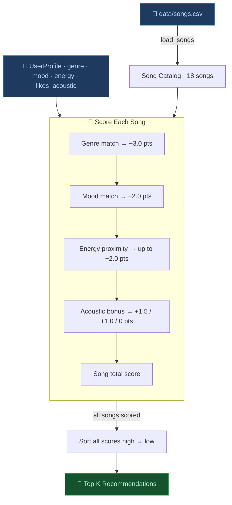
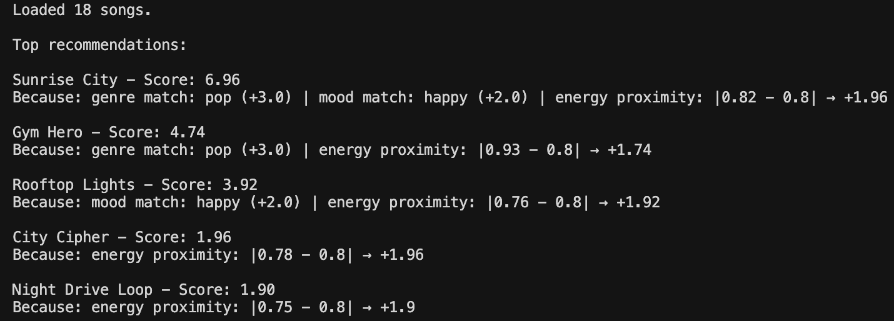
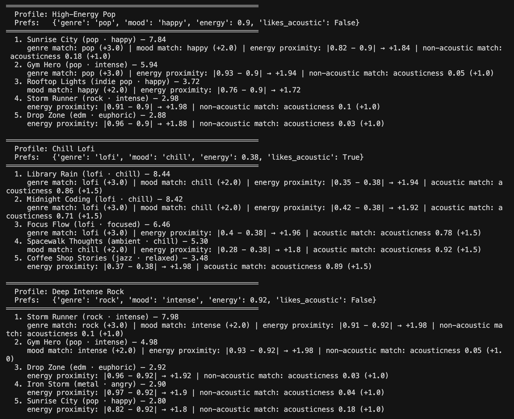
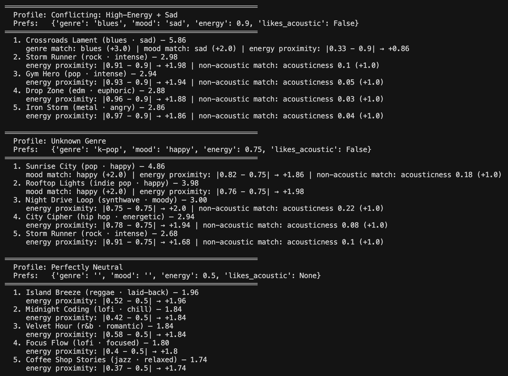

# 🎵 Music Recommender Simulation

## Project Summary

This recommender takes a user's preferred genre, mood, energy level, and acoustic preference, then scores each song in a 10-track catalog using a weighted formula. Genre and mood matches contribute a fixed bonus (3.0 and 2.0 points respectively), energy proximity is scored using 1 - |song.energy - target_energy| scaled by 2.0, and an acoustic bonus is awarded when the user's likes_acoustic preference aligns with the song's acousticness value. After every song is scored individually, the system ranks all songs by their total score and returns the top k results. The approach is content-based — it relies entirely on song attributes and a hand-crafted profile, with no listening history or other users involved.

---

## How The System Works

**What features does each Song use?**

Each song carries seven attributes: `genre` (e.g. lofi, pop, rock), `mood` (e.g. chill, happy, intense), `energy` (0.0–1.0, from very calm to very driving), `acousticness` (0.0–1.0, from fully electronic to fully acoustic), `valence` (0.0–1.0, how positive or upbeat the song feels), `danceability` (0.0–1.0), and `tempo_bpm` (beats per minute). The system primarily uses genre, mood, energy, and acousticness when scoring.

**What does the UserProfile store?**

The user profile stores four things: a `favorite_genre`, a `favorite_mood`, a `target_energy` value (a number between 0 and 1 representing how energetic the user wants their music to feel right now), and a `likes_acoustic` flag (true or false).

**How does the Recommender score each song?**

Every song in the catalog is scored independently against the user profile using a weighted formula:

- **Genre match** adds 3.0 points — the strongest signal, since genre is the clearest indicator of overall sound.
- **Mood match** adds 2.0 points — a useful tiebreaker when multiple songs have similar energy.
- **Energy proximity** contributes up to 2.0 points, calculated as `(1 - |song.energy - target_energy|) × 2.0`. A perfect energy match scores 2.0; a song at the opposite extreme scores 0.0.
- **Acoustic preference** adds 1.5 points if the user likes acoustic and the song's `acousticness` is above 0.6, or 1.0 points if the user prefers non-acoustic and the song's `acousticness` is below 0.3.

**How does the system choose which songs to recommend?**

After every song has been scored, the system sorts all songs from highest score to lowest and returns the top `k` results (default 5). If two songs tie on score, the one with the lower catalog ID appears first.

**Data flow diagram**



---

## Algorithm Recipe

A precise, step-by-step description of the scoring logic so it can be re-implemented or audited without reading the code.

**Inputs**
- A `UserProfile` with: `favorite_genre` (string), `favorite_mood` (string), `target_energy` (float 0–1), `likes_acoustic` (bool)
- A catalog of `Song` objects loaded from `data/songs.csv`
- An integer `k` (how many songs to return, default 5)

**For each song in the catalog:**

1. Start with `score = 0.0`
2. **Genre bonus** — if `song.genre == user.favorite_genre`, add `3.0`
3. **Mood bonus** — if `song.mood == user.favorite_mood`, add `2.0`
4. **Energy score** — add `(1.0 - abs(song.energy - user.target_energy)) * 2.0`
   - Perfect match → `+2.0`; opposite extreme → `+0.0`
5. **Acoustic bonus**
   - If `user.likes_acoustic` is `True` and `song.acousticness > 0.6` → add `1.5`
   - If `user.likes_acoustic` is `False` and `song.acousticness < 0.3` → add `1.0`
   - Otherwise → add `0.0`
6. Record `(song, score)`

**Ranking:**

7. Sort all `(song, score)` pairs by `score` descending
8. Break ties by `song.id` ascending
9. Return the first `k` songs

**Maximum possible score: 8.5** (genre + mood + perfect energy + acoustic bonus)

---

## Known Biases and Limitations

**Genre dominates the score.** At 3.0 points, a genre match outweighs a perfect energy match (2.0) and a mood match (2.0) combined when either of those is missing. A genuinely great fit on energy, mood, *and* acousticness can still lose to a weak genre match. This means the system can surface a song the user finds sonically wrong simply because the genre label matches.

**Mood and genre are correlated in this catalog.** Lofi songs are nearly always "chill," pop songs trend toward "happy" or "intense," and metal is "angry." A user who picks `genre=lofi` and `mood=chill` gets a double bonus on the same songs, amplifying the genre bias rather than correcting for it.

**The acoustic bonus is asymmetric.** A user who likes acoustic gets +1.5 while a user who dislikes acoustic gets only +1.0. Non-acoustic preferences are slightly under-rewarded.

**Energy is the only continuous, user-tunable signal.** Valence, danceability, and tempo are recorded in the data but play no role in scoring. A user who wants upbeat music (`valence`) or slow music (`tempo`) has no way to express that, and the system has no way to reward it.

**The catalog is tiny and genre-skewed.** With only 18 songs, a user whose favorite genre has fewer than 3 entries (e.g. metal, ambient, blues) will likely receive off-genre songs in their top K regardless of other preferences.

**No personalization over time.** Every session starts from scratch. The system cannot learn that a user skipped every "intense" song it recommended, or that they replayed "Library Rain" five times.

---

## Getting Started

### Setup

1. Create a virtual environment (optional but recommended):

   ```bash
   python -m venv .venv
   source .venv/bin/activate      # Mac or Linux
   .venv\Scripts\activate         # Windows

2. Install dependencies

```bash
pip install -r requirements.txt
```

3. Run the app:

```bash
python -m src.main
```

### Running Tests

Run the starter tests with:

```bash
pytest
```

You can add more tests in `tests/test_recommender.py`.

---

## Experiments You Tried



**Standard profiles (High-Energy Pop, Chill Lofi, Deep Intense Rock):**



**Adversarial profiles (Conflicting, Unknown Genre, Perfectly Neutral):**



The most revealing experiment was a weight shift that halved the genre bonus (3.0 → 1.5) and doubled the energy multiplier (2.0 → 4.0). Under the original weights, the Conflicting profile ("blues, sad, energy 0.9") ranked "Crossroads Lament" first by a comfortable 2.88-point margin, because the genre+mood double-match (+5.0) completely buried the energy mismatch. After the weight shift, that margin collapsed to just 0.26 points — the high-energy tracks had nearly caught up. This showed that the original system was far more sensitive to categorical labels than to how a song actually sounds, and that small weight changes can dramatically shift which songs surface for edge-case users.

---

## Limitations and Risks

This recommender works well when a user's preferences align with a well-represented genre in the catalog, but it struggles in several realistic situations. The catalog only contains 18 songs, so genres with a single entry (metal, ambient, blues) can never fill a top-5 list on their own. The system has no awareness of audio content — it cannot detect tempo feel, lyrical themes, or production texture beyond the seven numeric and categorical fields in the CSV. Genre dominance is the sharpest risk: because the genre bonus (+1.5 even after the weight shift) is a hard categorical match, a song that is a near-perfect fit on energy, mood, and acousticness will still lose to a weak genre match. Finally, the system has no memory — it resets completely each session and cannot learn that a user skipped every "intense" recommendation or replayed the same lofi track five times.

---

## Reflection

Read and complete `model_card.md`:

[**Model Card**](model_card.md)

Write 1 to 2 paragraphs here about what you learned:

- about how recommenders turn data into predictions
- about where bias or unfairness could show up in systems like this


---

## 7. `model_card_template.md`

Combines reflection and model card framing from the Module 3 guidance. :contentReference[oaicite:2]{index=2}  

```markdown
# 🎧 Model Card - Music Recommender Simulation

## 1. Model Name

Give your recommender a name, for example:

> VibeFinder 1.0

---

## 2. Intended Use

- What is this system trying to do
- Who is it for

Example:

> This model suggests 3 to 5 songs from a small catalog based on a user's preferred genre, mood, and energy level. It is for classroom exploration only, not for real users.

---

## 3. How It Works (Short Explanation)

Describe your scoring logic in plain language.

- What features of each song does it consider
- What information about the user does it use
- How does it turn those into a number

Try to avoid code in this section, treat it like an explanation to a non programmer.

---

## 4. Data

Describe your dataset.

- How many songs are in `data/songs.csv`
- Did you add or remove any songs
- What kinds of genres or moods are represented
- Whose taste does this data mostly reflect

---

## 5. Strengths

Where does your recommender work well

You can think about:
- Situations where the top results "felt right"
- Particular user profiles it served well
- Simplicity or transparency benefits

---

## 6. Limitations and Bias

Where does your recommender struggle

Some prompts:
- Does it ignore some genres or moods
- Does it treat all users as if they have the same taste shape
- Is it biased toward high energy or one genre by default
- How could this be unfair if used in a real product

---

## 7. Evaluation

How did you check your system

Examples:
- You tried multiple user profiles and wrote down whether the results matched your expectations
- You compared your simulation to what a real app like Spotify or YouTube tends to recommend
- You wrote tests for your scoring logic

You do not need a numeric metric, but if you used one, explain what it measures.

---

## 8. Future Work

If you had more time, how would you improve this recommender

Examples:

- Add support for multiple users and "group vibe" recommendations
- Balance diversity of songs instead of always picking the closest match
- Use more features, like tempo ranges or lyric themes

---

## 9. Personal Reflection

A few sentences about what you learned:

- What surprised you about how your system behaved
- How did building this change how you think about real music recommenders
- Where do you think human judgment still matters, even if the model seems "smart"

